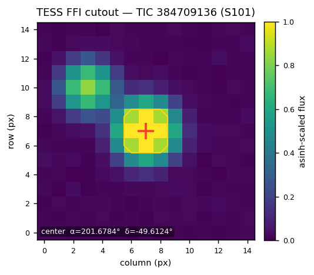
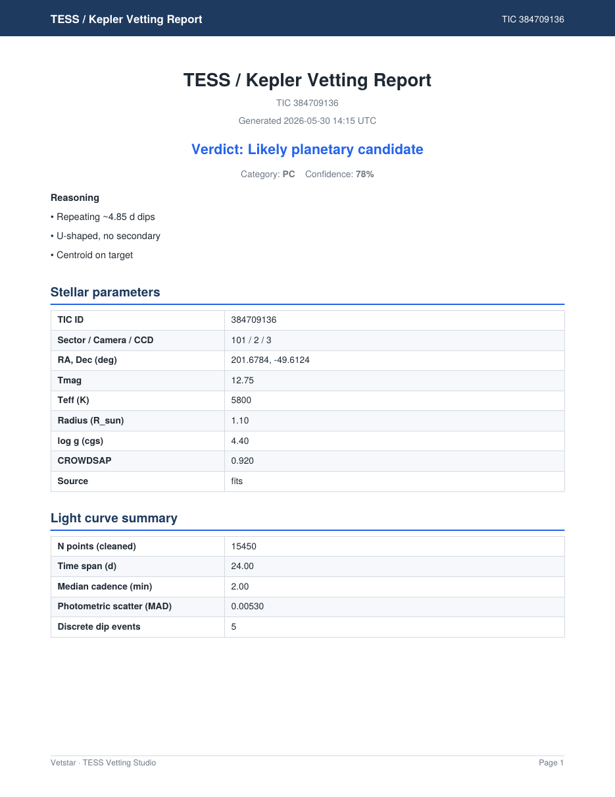
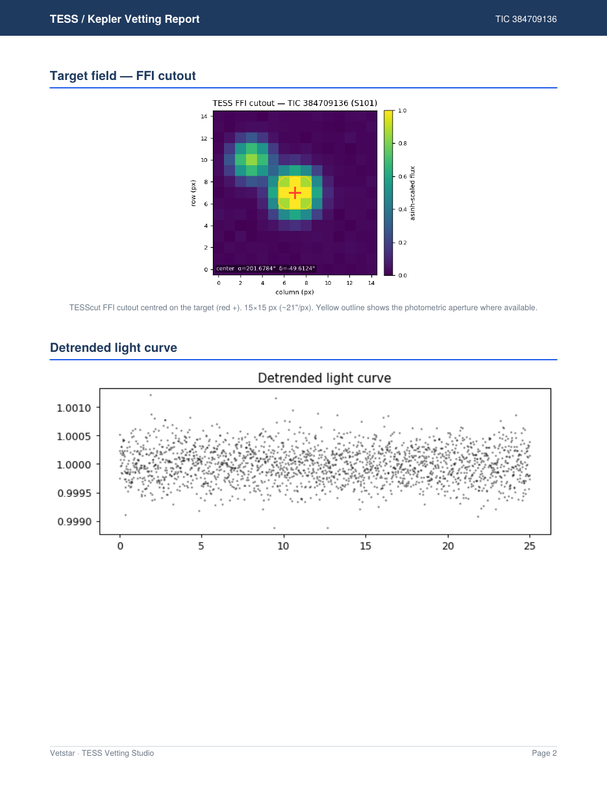

# Vetstar Alpha v0.1.3

*(TESS Vetting Studio)*

A web app for full transit / eclipse vetting of TESS light curves (legacy
Kepler files are also accepted), with a STEHM-based habitability scoring
engine and multi-sector analysis. Upload a SPOC FITS file (or pull one from
MAST by TIC + sector) and receive a complete vetting report with PDF export
— no install required.

**Live at <https://vetstar.onrender.com>**

The first visit after the service has been idle may take ~30 seconds to
wake up (free-tier cold start); after that it runs normally.

Source code and issue tracker: <https://github.com/eagnespuerto/vetstar>


## What it does

### Transit / eclipse vetting pipeline

- **Period searches** — Box Least Squares (BLS) + Lomb-Scargle periodograms
- **Adaptive dip event detection** with adjustable sensitivity (see below)
- **Centroid offset test** — distinguishes on-target events from background blends
- **Odd / even transit depth comparison** — eclipsing-binary indicator
- **Secondary eclipse search** at phase 0.5
- **Transit shape analysis** (U vs V, ingress / egress / flat-bottom durations)
- **Physics-based companion sizing** with CROWDSAP dilution correction
- **Target field — FFI cutout**: a Full-Frame-Image thumbnail of the patch
  of sky the light curve came from, fetched from MAST's **TESScut** service
  and rendered with an asinh / percentile stretch (the same scaling
  `astrocut` uses). The target is marked with a red **+** and the photometric
  aperture is outlined in yellow — a quick eyeball check for a bright
  neighbour or background eclipsing binary blended into the aperture (see
  [Example output](#example-output)). Auto-loads in its own panel below the
  results and is embedded in the PDF.
- **Automated verdict**: planet candidate / EB candidate / blend / ambiguous
- **Multi-event diagnostic plots**: full light curve with all events shaded
  and numbered, multi-panel zoom grid showing depth + duration + SNR per
  event, centroid behaviour, BLS and Lomb-Scargle periodograms
- **PDF report** for archiving — a clean, consistent multi-page layout: every
  page carries the same header band and a footer with page numbers, tables
  share one zebra-striped style, section headings stay attached to their
  content (no orphaned headings across page breaks), and embedded plots keep
  their true aspect ratio. The report is self-contained: alongside the vetting
  tables and diagnostic plots it embeds the **FFI cutout**, the **Habitability
  Chance Index** (with the combined HCI summary image — see below), the
  **predicted observables (POE)**, the **TLCM** transit-geometry values, and
  the full **ExoMiner** feature set (scalars + diagnostic views). These extra
  analyses are recomputed server-side at report time, so a single click yields
  a report covering every analysis the studio offers (each block is skipped
  gracefully if the underlying data — e.g. a TIC ID for ExoFOP — is
  unavailable).

### Habitability Chance Index (HCI)

A 0–100 score grounded in the **STEHM** (Smaller Than Earth Habitability
Model) framework from Hill et al. (2026), arXiv:2605.00170. The score is
built from six weighted sub-components:

| Component (weight) | Science basis |
|---|---|
| **Planet size** (30%) | STEHM's primary result: ≥0.8 R⊕ retains a long-term CO₂ atmosphere under Earth-like conditions; 0.7–0.8 R⊕ is marginal; <0.7 R⊕ loses it rapidly (Fig 5, §5). |
| **Habitable zone** (25%) | Kopparapu et al. (2013/2014) HZ boundaries, scaled by stellar luminosity. Outer-HZ planets retain atmospheres more easily (STEHM §5.5). |
| **Stellar type** (15%) | STEHM is calibrated for Sun-like (FGK) stars. M-dwarfs are penalised for higher XUV flux and non-thermal escape (§6). |
| **TOI disposition** (15%) | ExoFOP-TESS vetting flag. CP/KP (confirmed) = 1.0, PC/APC (candidate) = 0.75, FP (false positive) = 0.05. |
| **Vetting flags** (10%) | Our own pipeline's centroid / odd-even / secondary / companion-size results. |
| **Multi-sector** (5%) | Consistent detections across multiple TESS sectors confirm periodicity. |

Tiers: **Promising** (≥70) · **Marginal** (45–69) · **Unlikely** (20–44) ·
**Very unlikely** (<20). Confirmed EBs and false positives are hard-capped
at 12 regardless of other scores.

The HCI panel automatically queries **ExoFOP-TESS** for TOI data (planet
radius, period, semi-major axis, disposition) and stellar parameters. If
ExoFOP is unavailable it falls back to the TIC v8 catalog via astroquery.
All ExoFOP-derived values can be overridden from the request body.

**Light-curve-driven inputs.** Three sub-scores now fall back to direct
transit observables when catalogue values are missing, so the HCI can be
computed from the light curve alone:

- **Stellar type** — with no spectroscopic Teff, the host is typed from the
  transit-derived mean stellar density (Seager & Mallén-Ornelas 2003),
  inverted against the Pecaut & Mamajek (2013) main-sequence sequence to an
  approximate spectral type / Teff / radius (assumes a dwarf and a central
  transit; flagged in the caveats).
- **Habitable zone** — scored from the semi-major axis in AU when available
  (catalogue, override, or the TLCM photometric *a/R★ × R★*). When no AU value
  can be formed, it falls back to the instellation computed directly from the
  scaled semi-major axis, *S/S⊕ = (Teff/Teff☉)⁴ (215.03 / (a/R★))²*, scored
  against the Kopparapu et al. (2013/2014) flux boundaries — needing no
  catalogue luminosity or distance.
- **Planet size** — with no catalogue radius, *Rp = k × R★* from the radius
  ratio *k = √depth* and the (catalogue or density-estimated) stellar radius.

**HCI summary image (shareable).** Each HCI run also returns a single
Python-generated PNG (`hci_image`) that gathers, in one figure, the headline
score and tier, the six sub-score **metrics with their weightings**, and
side-by-side tables of the **predicted observables (POE)** and the **TLCM**
geometry values. The HCI panel keeps its interactive breakdown unchanged and
adds a collapsible **"Show HCI summary image"** section with a one-click
**Share** button (uploads to ImgBB for a link / Markdown / BBCode) and a PNG
download link. The same image is embedded on the HCI page of the PDF report.

### Predicted Observables for Exoplanets (POE)

Forward-model predicted observables using the NASA Exoplanet Archive POE
equations (NExScI), for both auto-detected candidates and user-specified
objects:

- **Stellar luminosity** from Teff and R*
- **Habitable-zone radii** (recent Venus / centre / early Mars) in AU, and in
  mas when a distance is known
- **Semi-major axis ⇄ orbital period** via Kepler's third law
- **Insolation flux** in Earth units
- **Radial-velocity semi-amplitude K** (forward model; planet mass estimated
  from radius via the Chen & Kipping 2017 mass–radius relation when not given)
- **Astrometric semi-amplitude Δθ** and **maximum projected separation**
  (distance permitting)
- **Predicted transit depth**

Results are surfaced in the Habitability panel and folded into the HCI
(semi-major axis derived from period feeds the habitable-zone sub-score) and
the ExoMiner scalar feature set (`a_au`, `insolation_searth`, `rv_k_ms`,
`transit_depth_pred_pct`).

### Transit geometry & absolute masses (TLCM)

Model-independent quantities from the light curve itself, following Csizmadia
(2020, MNRAS 496, 4442):

- **Radius ratio** k = Rp/Rs = sqrt(depth) (flagged as a lower limit for grazing
  transits)
- **Scaled semi-major axis** a/Rs from the transit duration (TLCM eq. 70), giving
  a **photometric semi-major axis** (a/Rs x R*) that needs no catalogue stellar mass
- **Model-independent stellar density** rho_* = 3pi/(G P^2)(a/Rs)^3 (eq. 59), and a
  stellar mass cross-check from rho_* + R*
- **Absolute companion mass** from the SB1 mass function f(m) = K^3 P (1-e^2)^{3/2}/(2 pi G)
  given a radial-velocity semi-amplitude K, solved exactly for Mp

The forward RV semi-amplitude K is computed two ways and cross-checked: the exact POE form and the Clubb (2008) textbook closed form (K = 203.255 m/s (1 day/P)^{1/3} (Mp sin i/Mjup)(Msun/M*)^{2/3} / sqrt(1-e^2)); they agree to <0.2% (the gap is the Mp<<M* approximation). The photometric semi-major axis is preferred over the Kepler-from-catalogue-mass
estimate when available, sharpening the HCI habitable-zone sub-score. Absolute mass
from RV (via `POST /api/rv`, which also accepts an RV time series and reduces it to
K by the min/max method) feeds the predicted observables and HCI. RV lookup is archive-first: it queries the NASA Exoplanet Archive `pscomppars` table for `pl_rvamp` and falls back to an uploaded RV series when the catalog has no K. The deploy must allow outbound HTTPS to `exoplanetarchive.ipac.caltech.edu`.

When an absolute companion mass is available (RV semi-amplitude from the archive, an uploaded RV series, or an explicit override), the HCI **planet-size sub-score** is refined by bulk density (mass/radius): a rocky-consistent density (>~3.3 g/cm^3) confirms a solid surface, while a low density (<~2.2 g/cm^3) flags a volatile/H-He envelope and downgrades the score regardless of radius. Mass is resolved automatically from the archive on each HCI run (fails safe to radius-only) and can be set explicitly via `planet_mass_earth`.

Planet mass from radius is computed with two relations for comparison — Chen & Kipping (2017, default) and a simple piecewise power-law — and both estimates plus their spread are reported (the mass-radius relation is the dominant error in the radius->mass->K chain). Select via `mr_relation` ("chen_kipping" | "powerlaw") on `/api/observables`.

The mass-radius spread is propagated into the HCI itself: when only an estimated mass is available, both relations are run, the density check is evaluated for each, and the resulting size-score spread is carried into a reported **HCI range** (e.g. 78.5 with a 69.5-78.5 band). A measured mass (RV) collapses the range to a single value.

The scaled semi-major axis a/Rs is computed two independent ways and cross-checked: from the transit duration (TLCM eq. 70) and from Kepler's third law / stellar density using catalogue M* and R* (a/Rs = (G M* P^2 / 4pi^2 R*^3)^{1/3}). Agreement validates the solution; a large discrepancy flags eccentricity, a grazing transit, dilution, or bad stellar parameters (TLCM Appendix A).

### ExoMiner feature extraction

Replicates the full ExoMiner TFRecord feature set (Valizadegan et al. 2022,
ApJ 926 120) from the parsed light curve, surfaced in an auto-expanding panel
below the standard vetting output. Produces seven phase-folded views —
global (2001-bin), local (201-bin), secondary (phase 0.5), odd-transit,
even-transit, and global / local centroid-motion views — plus scalar
diagnostics (period, duration, depth in ppm, transit count, odd/even σ,
secondary-depth σ, centroid-shift σ, scatter MAD, CROWDSAP, SG-detrend
window) with σ badges. The panel auto-runs once vetting finishes and can be
re-run manually. Backed by `POST /api/exominer`, which reads the most-recently
parsed light-curve arrays from a process-level cache keyed by (TIC, sector).

### Manual dip selector

When the automatic detector skips a dip you can see by eye, drag across the
interactive light-curve plot to mark a candidate event. The backend
characterises its depth, duration, U/V shape, and — when centroid moments are
cached — an on-target test, via `POST /api/manual_dip`.

### Plot sharing (ImgBB)

Every generated image — the diagnostic and phase-folded plots, the HCI
summary image, the ExoMiner views, and the multi-sector timeline / per-object
HCI / per-object ExoMiner views — has a share button that uploads the PNG to
ImgBB and returns a public link (with Markdown and BBCode embeds); an "upload
all plots" action bundles the full set into a single shareable album for
pasting into issues or collaboration threads.

### Multi-sector analysis

Chosen up front (a **Single sector / Multi-sector** toggle on the MAST card,
no need to run a single sector first). Fetches up to **5** TESS sectors for a
TIC from MAST — your selected sectors, capped to 5, or the newest 5 by
default — runs the vetting pipeline on each, and produces:

- A **detection timeline** bar chart (red = dip detected, grey = no dip)
  showing detection consistency across sectors
- **Object identification** — the **2 deepest events per sector** are pooled
  and grouped by transit duration into **up to 2 distinct objects**. Each
  object is **cross-confirmed** when it appears in ≥2 sectors with the *same
  transit duration* (within a ±0.05 h tolerance, `DURATION_MATCH_TOL_H`) and
  the *same period*. This separates, e.g., a real repeating planet from a
  second signal of different duration in the same target.
- A **per-sector verdict table** with event counts, BLS period, and SDE
- A **period consensus** estimate from sectors where BLS SDE > 6
- **Per-object HCI + ExoMiner** — for each identified object the pipeline
  recomputes the **Habitability Chance Index** (using the real multi-sector
  detection counts and the object's consensus period) and the full **ExoMiner**
  feature views, taken from the sector showing that object's deepest event.
- Automatic **HCI score update** with real multi-sector counts

Every image in the multi-sector panel — the detection timeline, each object's
HCI summary, and each ExoMiner view — has its own **Share** button (ImgBB
link / Markdown / BBCode).

The sector cap, events-per-sector, and object cap are tunable constants
(`MAX_SECTORS`, `EVENTS_PER_SECTOR`, `MAX_OBJECTS`) at the top of
`pipeline.py`.

### MAST integration

Two input modes in the web UI:

- **Upload file** — drag and drop a `.fits`, `.fits.gz`, `.json`, or
  `.customization` file
- **Fetch from MAST** — enter a TIC ID and sector. Click "List sectors"
  to see all TESS sectors with data for that TIC, with provider info
  (SPOC, TESS-SPOC, QLP) shown as clickable coloured chips.

The MAST fetcher tries data providers in preference order:

1. **SPOC 2-min** (best — includes quality flags, centroid columns, CROWDSAP)
2. **SPOC 20-s**
3. **TESS-SPOC FFI** (10-min from full-frame images; near-complete coverage)
4. **QLP** (Quick Look Pipeline FFI light curves)

When the app falls back past SPOC 2-min, an amber banner in the results
explains which provider/cadence was used and notes that the centroid test
is unavailable for FFI products.

The fetcher uses multiple name-resolution strategies (literal TIC name →
TIC catalog coordinate cone search → MAST object resolver) with
retry-and-exponential-backoff on transient MAST errors. Because MAST's
name/coordinate searches actually return a small cone around the target,
results are **filtered to the exact requested TIC** (by `target_name`) before
a product is chosen — otherwise a close neighbour in the same crowded TESS
field could be downloaded instead of the intended star.

If a very recent sector has observation metadata in MAST's catalog but the
SPOC/QLP pipeline hasn't finished processing the light curves yet, the app
returns a clear message explaining the data-availability timeline instead
of a cryptic error.


## Example output

A few representative outputs (illustrative — generated from a TESS-like
target):

**FFI cutout of the target field.** The target sits at the centre (red +),
with the photometric aperture outlined in yellow. Here a fainter neighbour is
visible to the upper-left — exactly the kind of nearby source that can dilute
a transit or, if it's the real variable, masquerade as one on the target.



**PDF report — cover page.** Verdict banner, stellar parameters, and the
light-curve summary, with the running header band and page footer that repeat
on every page.



**PDF report — target field page.** The FFI cutout and the detrended light
curve, each kept at its true aspect ratio.




## How to use the app

### Step 1 — load a light curve

Use the **Upload file** or **Fetch from MAST** tab. For MAST, enter a TIC
ID and click "List sectors" first to see which sectors have downloadable
data. Sectors shown with an amber background are FFI-only (no SPOC 2-min).
On the MAST tab a **Single sector / Multi-sector (≤5)** toggle lets you
choose the analysis scope up front (see Step 5 for multi-sector).

### Step 2 — adjust detection sensitivity (optional)

Below the tabs is a collapsed **⚙️ Detection sensitivity** panel. Two
sliders:

- **Depth threshold** (default `0.997`, range `0.95`–`0.999`) — the
  absolute floor for flagging dips. The label updates to show the
  equivalent percent depth ("flag dips deeper than 0.30%").

- **Minimum SNR** (default `4σ`, range `1σ`–`10σ`) — the *integrated*
  significance a dip must reach. Significance is measured over the whole
  event, not a single point: `mean depth × √(in-transit points) / scatter`.
  The √N factor is what lets a shallow transit on a noisy star qualify —
  e.g. an 0.8%-deep, ~5 h transit on a star with 0.5% point scatter has a
  per-point SNR near 1 but an integrated SNR around 10.

**How the adaptive detection works.** The pipeline computes the star's
actual scatter (MAD of out-of-dip points) and sets an adaptive threshold:
`baseline − SNR × scatter`. The effective threshold is the *more
sensitive* of the user's absolute threshold and the adaptive threshold.
This means:

- **Deep dips on noisy stars** (like a 2.8% EB): the absolute threshold
  (0.997) does the work, same as always.
- **Shallow dips on quiet stars** (like a 0.06% transit on a star with
  0.02% scatter): the adaptive threshold (e.g. `1.0 − 3×0.0002 = 0.9994`)
  catches them — the old fixed threshold couldn't.
- **Pure noise**: the integrated per-event SNR check rejects spurious
  crossings — a one- or two-point dip can't accumulate enough significance.
  Contiguous in-dip stretches split only by a few noisy points are bridged,
  so one transit is reported as one event rather than several fragments.

**Rule of thumb:**

- Missing a real shallow transit you can see by eye? → lower SNR to 3σ
- Lots of fake "events" on a noisy star? → raise SNR to 5–6σ
- Need to flag a dip ≲0.2% deep? → lower SNR *and* push threshold toward
  0.999 — the two filters work together

### Step 3 — run vetting

Click **Run vetting** (Upload tab) or **Fetch & vet** (MAST tab). Analysis
takes 10–30 seconds. You'll see:

- A **verdict banner** (planet candidate / large planet candidate / EB
  candidate / blend / ambiguous) with confidence
- **Stellar parameters** and **light curve summary**
- **Diagnostic plots**: full detrended light curve with all events shaded
  (primary in red, others in orange, each numbered), a zoom grid showing
  each event's shape / depth / duration / SNR, centroid behaviour, BLS and
  Lomb-Scargle periodograms
- **Test tables**: BLS, Lomb-Scargle, centroid, odd/even, secondary
  eclipse, transit shape, physical interpretation
- **Event table** listing every dip with timing and depth
- A **Target field** panel with the FFI cutout (auto-loads), showing the
  target and aperture on the sky

### Step 4 — compute habitability score

At the bottom of the results, click **Compute HCI**. The app queries
ExoFOP-TESS for the target's TOI data and stellar parameters, then
computes the Habitability Chance Index. The score panel shows:

- A large **score / 100** with a colour-coded tier and progress bar
- The **planet and TOI info** used (radius, period, semi-major axis,
  disposition, data source)
- An expandable **score breakdown** with six sub-score bars, each labelled
  with its weight, tier, and a one-sentence explanation referencing the
  relevant STEHM paper section
- A **TOI table** if the star has multiple TOIs on ExoFOP
- **Caveats** listing model limitations and the paper reference

### Step 5 — multi-sector analysis

Pick **Multi-sector (≤5)** in the scope toggle on the MAST card (you can do
this from the start — no single-sector run required). Optionally click up to
5 sectors to include, or leave blank for the newest 5. Click **Run
multi-sector**. The app fetches the sectors, runs the full pipeline on each,
and displays:

- A **detection timeline** bar chart across sectors
- **Up to 2 identified objects**, each shown with its median duration, depth,
  period, the sectors it appears in, and a confirmed / mismatch banner from
  the same-duration (±0.05 h) and same-period cross-check
- For **each object**, its **HCI score + summary image** and full **ExoMiner
  feature views**, recomputed from the sector with that object's deepest event
- A **per-sector verdict table** with event counts and BLS results
- A **period consensus** from consistent BLS peaks
- The **HCI score automatically updates** with the real sector counts

Every image in the panel (timeline, HCI summaries, ExoMiner views) has a
**Share** button.

### Step 6 — download PDF

Click **Download PDF report** or **Fetch & download PDF** for a clean
multi-page PDF (repeating header band + page-numbered footer) with the
verdict, all vetting tables, diagnostic plots, the FFI cutout, the HCI
summary (including the combined HCI/observables/TLCM image), and the
ExoMiner feature set.


## Verdict logic

Evaluated in order:

1. Implied companion radius **> 4.0 R_Jup** (`COMPANION_EB_HARD_RJUP`) →
   **eclipsing binary candidate** (unambiguously stellar / brown-dwarf sized).
2. Secondary eclipse detected, or odd/even depths differ > 3σ → **EB**.
3. Centroid offset > 3σ → **likely blend** (background eclipsing binary).
4. Implied radius **between the ~2.2 R_Jup planetary cap and 4.0 R_Jup** with
   *no* corroborating eclipse signature → **large planet candidate (RV needed
   to exclude a brown dwarf)**. A borderline-large radius is no longer treated
   as proof of an EB on its own — matching the behaviour of more mature vetting
   pipelines. An eclipse signature or an RV mass is required to confirm an EB.
5. Planet-sized companion implied (< 2.2 R_Jup) → **planet candidate**.
6. Else → **ambiguous** or **no signal** based on BLS SDE.

Transit-duration consistency feeds in as a supporting signal: durations that
agree across events to within ±0.05 h (`DURATION_MATCH_TOL_H`) reinforce a
single real transit, while larger variation raises a `duration_inconsistent`
caution (possible blend or multiple signals). The companion-size cap
(`COMPANION_PLANET_CAP_RJUP`, `COMPANION_EB_HARD_RJUP`) and duration tolerance
are tunable constants in `pipeline.py`.


## Report bugs or contribute

Click **Report an Issue or Contribute** in the page header, or go to
<https://github.com/eagnespuerto/vetstar>. When reporting a bug, include:

- The TIC ID and sector you were analysing (or attach the FITS)
- The exact error message
- Whether you adjusted the sensitivity sliders
- Browser console output if available (F12 → Console tab)


## Limitations and disclaimers

- **Alpha release.** The pipeline is useful but is not a substitute for
  full vetting tools like DAVE, VESPA, or the TESS-SPOC Data Validation
  Report.
- **Always cross-check** candidates with ExoFOP, Gaia DR3 (especially
  RUWE for binarity), and high-resolution imaging before publishing.
- **STEHM model scope.** The HCI is based on a stagnant-lid CO₂ atmosphere
  model calibrated for Sun-like stars. It does not include non-thermal
  escape, magnetic fields, plate tectonics, or M-dwarf XUV histories
  (Hill et al. 2026 §6). The score is a first-order estimate only.
- **Free-tier hosting.** Render's free plan sleeps after ~15 min idle;
  cold-start takes ~30 seconds. Analysis itself is fast once warm.
- **Recent sectors.** TESS data typically become available at MAST 1–2
  months after the sector ends. Very recent sectors may show observation
  metadata in the sector list but return a "no products yet" error — this
  is expected and the error message explains the timeline.


---

## Developer info

### Run locally

```bash
python app.py
```

Installs Python deps if missing, builds the React frontend if needed,
starts a single Uvicorn process at `http://127.0.0.1:8000`.

Requirements: Python ≥ 3.10 and Node.js ≥ 18 (first run only).

```bash
python app.py --port 9000          # custom port
python app.py --host 0.0.0.0       # listen on all interfaces
python app.py --reload             # auto-reload on backend changes
python app.py --skip-build         # don't rebuild the frontend
python app.py --api-only           # API only, no SPA
```

### API endpoints

```
POST /api/analyze              multipart file + ?detect_threshold=&detect_min_snr=  → JSON
POST /api/report               multipart file + ?detect_threshold=&detect_min_snr=  → PDF (incl. HCI + ExoMiner)
GET  /api/mast/sectors/{tic}                                                        → sector list
POST /api/mast/analyze         {tic_id, sector, detect_threshold, detect_min_snr}   → JSON
POST /api/mast/report          {tic_id, sector, detect_threshold, detect_min_snr}   → PDF (incl. HCI + ExoMiner)
POST /api/habitability         {tic_id, ...optional overrides}                      → HCI JSON (+ hci_image PNG)
POST /api/observables          {tic_id?, stellar/orbit/planet params, vetting_verdict?} → POE JSON
POST /api/rv                   {tic_id? (archive K), or k_ms|rv_values_ms + orbital_period_d} → mass function + absolute mass
POST /api/mast/multisector     {tic_id, ?sectors (≤5), detect_threshold, detect_min_snr} → timeline + up-to-2 objects (each w/ HCI + ExoMiner) JSON
POST /api/exominer             {tic_id?, sector?, ...}  (uses cached light curve)   → ExoMiner views + scalars
POST /api/ffi_cutout           {ra, dec, sector?, tic_id?, size_px?}                → TESScut FFI cutout PNG (cached)
POST /api/manual_dip           {tic_id?, sector?, t_start, t_end}                   → manual dip characterisation
GET  /api/health                                                                    → {"status":"ok"}
GET  /docs                                                                          → Swagger UI
```

### Project layout

```
vetstar/
├── app.py                      ← single-command launcher
├── backend/
│   ├── app/
│   │   ├── main.py             FastAPI endpoints + SPA mount
│   │   ├── pipeline.py         BLS, LS, adaptive detection, centroid, shape, physics
│   │   ├── parsers.py          FITS + ExoFOP JSON readers
│   │   ├── mast_fetch.py       Multi-strategy MAST downloader with retry
│   │   ├── habitability.py     STEHM-based HCI scoring engine
│   │   ├── observables.py      POE forward-modelled observables
│   │   ├── tlcm_geometry.py    Transit geometry + absolute masses (TLCM)
│   │   ├── rv_fetch.py         Archive-first radial-velocity lookup
│   │   ├── exominer.py         ExoMiner feature/view extraction
│   │   ├── ffi_cutout.py       TESScut FFI cutout fetch + render (astrocut-style stretch)
│   │   ├── hci_image.py        HCI summary image (metrics + weightings + observables + TLCM)
│   │   ├── tic_catalog.py      TIC v8 catalog helper
│   │   ├── exofop.py           ExoFOP-TESS + TIC catalog querier
│   │   └── report.py           Clean multi-page PDF builder (running header/footer, unified tables)
│   └── requirements.txt
├── frontend/
│   ├── src/
│   │   ├── App.tsx             Tabs, single/multi-sector scope toggle, sensitivity panel, results, HCI, multisector
│   │   ├── ExoMinerPanel.tsx   ExoMiner views + scalar diagnostics panel
│   │   ├── FfiCutoutPanel.tsx   TESScut FFI cutout panel (auto-loads under results)
│   │   ├── ManualDipSelector.tsx  Drag-to-mark manual dip tool
│   │   ├── ShareButton.tsx     ImgBB plot-sharing buttons
│   │   ├── imgbb.ts            ImgBB upload client
│   │   ├── glossary.ts         Term tooltips
│   │   ├── api.ts              API client
│   │   └── types.ts            Shared TypeScript types
│   ├── index.html
│   └── package.json
├── Dockerfile                  Multi-stage build with context validation
├── render.yaml                 Render Blueprint
├── fly.toml                    Fly.io app config
└── .github/workflows/
    ├── ci-deploy.yml           CI + auto-deploy to Render or Fly
    └── build.yml               Cross-platform exe builder
```

### Deploy your own copy

**Render** — push to GitHub, sign up at <https://render.com>, New →
Blueprint → connect your repo. Render reads `render.yaml` and provisions
automatically. Free tier sleeps after 15 min idle.

**Fly.io** — `fly auth login` then `fly launch --no-deploy --copy-config`
then `fly deploy`. The included `fly.toml` provisions a shared-cpu-1x
machine with 1 GB RAM (within the free allowance). No idle sleep. Requires
a credit card on file (no charges within the free tier).

Auto-deploy on push: set the `FLY_API_TOKEN` or `RENDER_DEPLOY_HOOK` repo
secret in GitHub; the CI workflow handles the rest.

### Build a standalone executable

```bash
python build_exe.py
```

PyInstaller bundles everything into one binary (~180–230 MB). Double-click
to launch; a browser opens to the app automatically.

### References

- Hill, M. L., Kane, S. R., Foley, B. J., & Schaefer, L. K. (2026).
  *Smaller Than Earth Habitability Model (STEHM): The Lower Size Limit for
  Atmosphere Retention in the Habitable Zone.* arXiv:2605.00170v1.
- Kopparapu, R. K. et al. (2013, 2014). *Habitable Zone boundaries.*
  ApJ 765, 131; ApJ 787, L29.
- Seager, S. & Mallén-Ornelas, G. (2003). *A unique solution of planet and
  star parameters from an extrasolar planet transit light curve.* ApJ 585, 1038.
- Pecaut, M. J. & Mamajek, E. E. (2013). *Intrinsic colors, temperatures, and
  bolometric corrections of pre-main-sequence stars.* ApJS 208, 9.
- Tian, F. et al. (2009). *CO₂ escape from early Mars.*
  Geophys. Res. Lett. 36, L02205.
- Kite, E. S. & Barnett, M. N. (2020). *Exoplanet secondary atmospheres.*
  PNAS 117, 18264.

### License

CC0-1.0. See `LICENSE`.
