# Vetstar — Scientific & Technical Pipeline Documentation

This document walks through the *physics, statistics, and algorithms* behind
every stage of the Vetstar pipeline. It is the companion to the user-facing
[README](../README.md): the README tells you **what** the app does, this
document tells you **how** and **why**.

Each equation below is rendered as a LaTeX-generated PNG
(see `docs/render_equations.ps1` to regenerate them). Symbols follow
standard astrophysics convention: `★` = host star, `p` = planet/companion,
`⊕` = Earth, `☉` = Sun.

---

## Table of contents

1. [Light-curve ingestion & detrending](#1-light-curve-ingestion--detrending)
   - 1.1 [Savitzky-Golay baseline removal](#11-savitzky-golay-baseline-removal)
   - 1.2 [Optional sinusoidal-regression detrend (high stellar variability)](#12-optional-sinusoidal-regression-detrend-high-stellar-variability)
2. [Adaptive dip detection](#2-adaptive-dip-detection)
3. [Periodograms — BLS & Lomb-Scargle](#3-periodograms--bls--lomb-scargle)
4. [Phase folding & transit-model fit](#4-phase-folding--transit-model-fit)
5. [Diagnostic tests](#5-diagnostic-tests)
   - 5.1 [Centroid offset test](#51-centroid-offset-test)
   - 5.2 [Odd / even depth comparison](#52-odd--even-depth-comparison)
   - 5.3 [Secondary-eclipse search](#53-secondary-eclipse-search)
   - 5.4 [CROWDSAP dilution correction](#54-crowdsap-dilution-correction)
6. [Transit geometry (TLCM)](#6-transit-geometry-tlcm)
7. [Predicted Observables for Exoplanets (POE)](#7-predicted-observables-for-exoplanets-poe)
8. [Radial-velocity reduction & absolute mass](#8-radial-velocity-reduction--absolute-mass)
9. [Habitability Chance Index (HCI)](#9-habitability-chance-index-hci)
10. [ExoMiner feature extraction](#10-exominer-feature-extraction)
11. [FFI cutout rendering](#11-ffi-cutout-rendering)
12. [Multi-sector aggregation](#12-multi-sector-aggregation)
13. [Time-system conventions](#13-time-system-conventions)
14. [References](#14-references)

---

## 1. Light-curve ingestion & detrending

Vetstar accepts SPOC FITS, TESS-SPOC FFI, QLP FFI, or legacy Kepler FITS.
The parser (`backend/app/parsers.py`) extracts the time series and quality
flags, then normalises the flux to a baseline of unity. For SPOC products
the **PDCSAP_FLUX** column is preferred (planetary-friendly systematics
removal); legacy Kepler PDCSAP_FLUX is treated identically.

### 1.1 Savitzky-Golay baseline removal

Detrending is done with a **Savitzky-Golay** filter sized adaptively to the
data cadence. The detrended flux

```
f_norm(t) = f_raw(t) / SG_window(f_raw, w)
```

leaves transit-depth signals undisturbed while removing slow stellar
variability. Sample-to-sample jumps larger than ~5× the median cadence are
flagged as data gaps (downlinks, momentum dumps, scattered-light excisions);
events cannot span a gap, which prevents a multi-day outage from registering
as one very wide "dip".

The robust scatter of the out-of-dip baseline is measured with the **median
absolute deviation** (MAD), scaled to a Gaussian-equivalent σ:

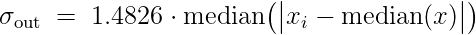

The 1.4826 factor is the standard MAD→σ conversion for a Gaussian. MAD is
preferred over the sample standard deviation because real light curves carry
outliers (cosmic rays, momentum-dump residuals) that inflate `std()` but
leave the median essentially untouched.

### 1.2 Optional sinusoidal-regression detrend (high stellar variability)

Spotted rotators, ellipsoidal binaries, and other wave-like variables carry
a stellar signal whose amplitude is often **much larger than a planetary
transit**. The Savitzky-Golay window above is sized for SPOC-style
systematics removal and intentionally leaves coherent oscillations of period
≳ 1 d intact, so on these targets BLS spends most of its power on the
rotation signal and misses shallow dips.

When the user opts in (the **High stellar variability** toggle in the UI;
`high_variability=true` on the API), Vetstar fits a sine plus its first
harmonic, at a fixed period `P`, by ordinary linear least squares:

```
f(t) ≈ C + A₁·sin(2π t / P) + B₁·cos(2π t / P)
         + A₂·sin(4π t / P) + B₂·cos(4π t / P)
```

The five free coefficients `(C, A₁, B₁, A₂, B₂)` are recovered by
`numpy.linalg.lstsq` against the 5-column design matrix
`[1, sin(ω t), cos(ω t), sin(2ω t), cos(2ω t)]` with `ω = 2π / P`. Fixing
`P` keeps the problem linear and closed-form — the alternative of treating
`P` as a free parameter would make the system nonlinear and overlap
strongly with BLS itself.

**Period selection.** If `rotation_period_days` is supplied, it is used
verbatim. Otherwise the **Lomb-Scargle top peak** from §3.2 is used. The
choice is recorded in the result as `detrend.reason ∈ {"user_period",
"ls_peak"}`.

**Amplitude.** The fitted fundamental amplitude (peak, not RMS) is
`A = √(A₁² + B₁²)`, reported in ppm of the median flux. The harmonic
amplitude `√(A₂² + B₂²)` is reported separately.

**Skip condition.** Fitting a sinusoid to pure white noise produces a
non-zero amplitude purely by chance. Vetstar therefore estimates the
per-cadence high-frequency noise floor


using the point-to-point MAD on the *flux differences*,

```
σ_floor ≈ 1.4826 · median |Δf| / √2     (ppm × 1e6)
```

(the `/√2` factor follows from `Var(Δf) = 2 σ²` for white noise; this form
is the standard photometric noise estimator and, unlike `MAD(f − 1)`, is
**not** biased by the very low-frequency variability we are about to fit).
When the fitted fundamental amplitude falls below `σ_floor` the detrend is
declared a fit-to-noise and **skipped**; the original flux is fed to BLS
and `detrend.reason = "skipped_low_amplitude"`.

**Residuals.** When the fit is applied, the BLS input becomes

```
f_resid(t) = f(t) − [C + A₁·sin(ωt) + B₁·cos(ωt)
                       + A₂·sin(2ωt) + B₂·cos(2ωt)]   + 1.0
```

(the trailing `+ 1.0` re-centres around unity since `C` already absorbs the
mean of `f`). The diagnostic plot panel emits a 3-row figure — raw flux
with the fitted model overlaid, the model alone, and the residual that BLS
actually sees — so the user can verify that the rotation signal was
captured cleanly without distorting the in-transit cadences. The fit and
the RMS-reduction percentage `100 · (σ_before − σ_after) / σ_before` are
recorded in the JSON response and the PDF report.

**Multi-sector behaviour.** Each sector is detrended independently against
its own LS peak (or the same user-supplied period applied per-sector).
Rotation phase is **not** preserved across the multi-month gaps between
TESS sectors, so a single global fit would be wrong; running the
regression per-sector is correct and is what the multi-sector pipeline
does internally before its BLS pass.

**Defaults preserve pre-feature behaviour.** With `high_variability=false`
the entire block is bypassed and `f_resid ≡ f`; the regression test
`test_defaults_match_pre_change_pipeline_output` locks BLS period, SDE,
secondary-detected, and verdict category to their pre-change values.

---

## 2. Adaptive dip detection

The studio combines two thresholds and picks whichever is more sensitive:

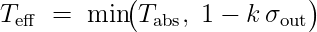

with `T_abs` the user-set absolute floor (default 0.997 — flag dips deeper
than 0.3%) and `k` the user-set SNR floor (default 4σ). For a quiet star
where the MAD-σ is 0.0002, this yields an effective threshold of
0.9992 — far more sensitive than the fixed default — while for a noisy
star it simply falls back to `T_abs`.

Each candidate event must additionally clear an **integrated SNR** test:

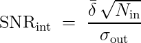

where  `δ̄`  is the mean fractional depth of the event,  `N_in`  is the
number of in-transit samples, and  `σ_out`  is the out-of-dip MAD-σ. The
`√N_in` factor is what allows a shallow transit on a noisy star to qualify:
a 0.8 %-deep, 5-hour transit on a star with 0.5 % point scatter has a
per-point SNR near 1 but an integrated SNR around 10. This is the same
matched-filter logic used by the BLS in §3 and by ExoMiner's local-view
significance score.

Events whose interior is interrupted only by a handful of noisy points are
bridged so a single transit reports as one event rather than several
fragments.

---

## 3. Periodograms — BLS & Lomb-Scargle

### 3.1 Box Least Squares (BLS)

BLS (Kovács, Zucker & Mazeh 2002) is the matched-filter optimised for a
**boxcar** transit shape: a baseline flux dropping briefly by `δ`, then
returning. Vetstar uses `astropy.timeseries.BoxLeastSquares`.

The frequency-domain output is the **signal residue** SR; Vetstar's quoted
**Signal Detection Efficiency (SDE)** standardises the peak against the
periodogram's own baseline:

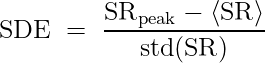

We flag SDE > 6 as a confident period detection. Per-event significance is
recomputed using the integrated-SNR formula of §2 — BLS provides the
**period, depth, duration, epoch**, but Vetstar's adaptive detector decides
which individual events are real.

### 3.2 Lomb-Scargle

The classical (Press & Rybicki 1989) Lomb-Scargle power at angular
frequency ω is

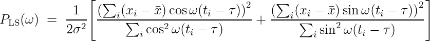

with `τ` the standard time-offset that orthogonalises the sine and cosine
sums. Lomb-Scargle is sensitive to **sinusoidal variability** (rotation,
ellipsoidal variation, contact-binary modulation). A high LS peak at the
**same** period as the BLS peak — or, more often, at **half** the BLS
period — is a strong eclipsing-binary indicator.

---

## 4. Phase folding & transit-model fit

Phase folding maps time to a phase in [−½, ½):

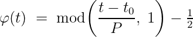

Phase 0 is transit centre. The folded curve is binned to two grids:
**global** (2001 bins across the full phase) and **local** (201 bins
spanning ±2 transit durations). This matches the ExoMiner convention so the
same views can be fed downstream to the ExoMiner feature extractor (§10).

When a **SPOC Data Validation Time Series (DVT)** file is available,
Vetstar overlays the SPOC-fitted Mandel-Agol transit model (`MODEL_INIT`)
on the binned data (`LC_INIT`). The DVT file also supplies sharper values
for the geometric parameters `a/R★` (`ARAT`) and impact parameter `b`
(`IMPACT`), which feed the TLCM block of §6 directly.

---

## 5. Diagnostic tests

### 5.1 Centroid offset test

For SPOC 2-min products the FITS table carries the per-cadence centroid
columns `MOM_CENTR1`, `MOM_CENTR2`. Vetstar computes the in-transit centroid
mean and compares against the out-of-transit baseline:

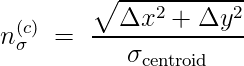

A significant offset (default > 3σ) means the photometric centre of light
moved *off* the target during the dip — the canonical signature of a
**background eclipsing binary** diluted into the SPOC aperture. FFI
products (TESS-SPOC, QLP) do not carry centroid columns, so the test is
skipped with an amber banner.

### 5.2 Odd / even depth comparison

For an eclipsing binary near unit mass ratio, the primary and secondary
eclipses can be **similar in depth**, but a true planet's odd- and
even-numbered transits must agree. Vetstar measures the depth of every
detected event, partitions them by index parity, and computes:

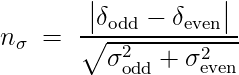

A difference > 3σ flags the candidate as a probable EB. Each side of the
ratio carries the in-event MAD-σ propagated through the depth average.

### 5.3 Secondary-eclipse search

The phase-folded curve is searched at φ = 0.5 for a shallower secondary
dip. The required significance reuses the integrated-SNR formula: the
secondary depth `δ_sec` is compared against the out-of-eclipse scatter
`σ_oot / √N_in`, and the dip is **detected** when

```
δ_sec / (σ_oot / √N_in)  >  σ_thresh
```

`σ_thresh` is a user-tunable threshold (the **Secondary eclipse σ** slider
in the UI, `secondary_sigma` on the API) bounded to **1.0σ–7.0σ** by the
backend (HTTP 422 outside the range), defaulting to **3σ**. Lowering it
surfaces more EB candidates at the cost of more false positives on noisy
stars; raising it is stricter. A positive secondary at the BLS period
(and not at any plausible orbital harmonic) is recorded as a strong EB
indicator and feeds the verdict logic of the README.

### 5.4 CROWDSAP dilution correction

SPOC propagates a `CROWDSAP` keyword: the fraction of flux in the optimal
aperture that actually belongs to the target (the rest comes from blended
neighbours). Observed transit depths must be inflated to true source-frame
depths before any radius inference:

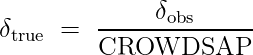

CROWDSAP < 1 always *underestimates* the true depth; a 0.5%-observed
transit on a CROWDSAP = 0.5 target is really a 1.0% transit on the source.
FFI products without CROWDSAP are flagged so the caller knows the
companion-radius estimate is a lower limit.

---

## 6. Transit geometry (TLCM)

The Transit Light Curve Model framework (Csizmadia 2020) gives a set of
**model-independent** quantities derivable from a single well-sampled
transit alone, without needing a catalogue stellar mass.

### 6.1 Radius ratio

From the dilution-corrected depth:

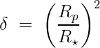

so `k = Rp / R★ = √δ`. The corresponding companion radius is

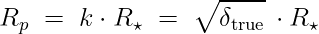

For a grazing transit, the observed depth is a lower bound on `k²`; Vetstar
flags this and propagates the caveat to the verdict (§5 in the README).

### 6.2 Scaled semi-major axis from duration

Combining Kepler's third law with the chord-length geometry of a transit
(Csizmadia 2020 eq. 70) gives, for a known total duration `T₁₄`, impact
parameter `b`, and radius ratio `k`:

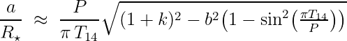

When a DVT file is available, the SPOC-fitted `ARAT` and `IMPACT` replace
this duration-derived estimate; otherwise Vetstar assumes a central transit
(`b = 0`) and flags the assumption in the caveats.

### 6.3 Model-independent stellar density

The Seager & Mallén-Ornelas (2003) relation drops out:

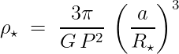

`ρ★` requires only `P` and `a/R★`. With `R★` from any source (ExoFOP, TIC
v8, Gaia DR3, or — in the fully-fallback case — the Pecaut & Mamajek (2013)
main-sequence interpolated against this density) Vetstar recovers a
stellar **mass** cross-check `M★ = (4/3)π R★³ ρ★`.

### 6.4 Photometric semi-major axis

Multiplying `a/R★` by the stellar radius gives a *photometric* `a`
independent of any catalogue mass. The alternative — Kepler's third law
from a catalogue stellar mass —

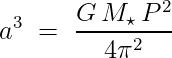

is also computed; agreement to within a few percent validates the solution.
A large discrepancy flags eccentricity, a grazing transit, dilution, or
bad stellar parameters (Csizmadia 2020 Appendix A).

---

## 7. Predicted Observables for Exoplanets (POE)

Vetstar implements the NASA Exoplanet Archive POE equations end-to-end.

### 7.1 Bolometric luminosity

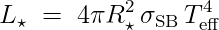

with σ_SB the Stefan-Boltzmann constant. Vetstar reports `L★ / L☉`, which
also drives the habitable-zone calculation below.

### 7.2 Habitable-zone boundaries (Kopparapu)

The Kopparapu et al. (2013, 2014) HZ boundaries are quartic in
`T★ = T_eff − 5780 K`:

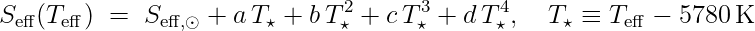

with coefficients `(S_eff,☉, a, b, c, d)` tabulated for each boundary
(recent Venus, runaway greenhouse, maximum greenhouse, early Mars).
The HZ distance in AU is then:

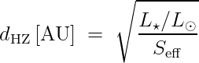

### 7.3 Instellation and equilibrium temperature

When no luminosity or distance is available, Vetstar falls back to the
**scaled-semi-major-axis** form of the instellation:

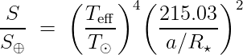

(215.03 = 1 AU / R☉, ensuring dimensional consistency.) The equilibrium
temperature, assuming zero albedo and full redistribution, is:

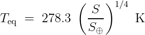

Both quantities feed the HCI habitable-zone sub-score (§9) when no
catalogue luminosity is available.

### 7.4 Radial-velocity semi-amplitude (forward model)

The Clubb (2008) closed form, used in POE:

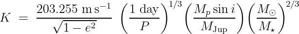

For unknown planet mass `M_p`, Vetstar plugs in the Chen & Kipping (2017)
mass-radius relation (§8.2). The forward `K` feeds both the POE display
and the HCI density-aware planet-size sub-score.

---

## 8. Radial-velocity reduction & absolute mass

### 8.1 Mass function

A single-line spectroscopic binary obeys the mass function

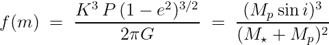

The left-hand side is *fully observable* from a phased RV time series:
fit the radial-velocity semi-amplitude `K` (Vetstar uses the simple
min/max method on an uploaded RV series, or queries
`NASA Exoplanet Archive pscomppars` for `pl_rvamp`), combine with `P` and
`e`, and you have `f(m)`. The right-hand side then gives the absolute
companion mass `M_p` exactly (cubic root) once `M★` is known.

### 8.2 Mass-radius relations

Two complementary forms are reported so the dominant systematic — the
mass-radius scatter — is visible:

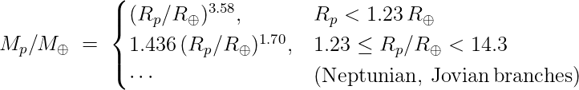

and a simpler piecewise power-law. The full HCI calculation runs both,
takes the resulting *range* of size-scores, and presents a banded score
(e.g. 78.5 with a 69.5-78.5 band). A measured mass from RV collapses the
band to a single value.

### 8.3 Bulk density classification

When `M_p` is available, the bulk density

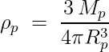

informs the HCI planet-size sub-score: ρ ≳ 3.3 g cm⁻³ is rocky-consistent
and confirms a solid surface; ρ ≲ 2.2 g cm⁻³ flags a volatile / H-He
envelope and downgrades the score regardless of radius.

---

## 9. Habitability Chance Index (HCI)

The HCI is a 0-100 weighted sum of six sub-scores, each in [0, 1]:

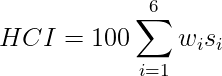

with weights `wᵢ = (0.30, 0.25, 0.15, 0.15, 0.10, 0.05)` for
**size, habitable-zone, stellar type, TOI disposition, vetting flags,
multi-sector**. The weighting is the contribution declared in
`backend/app/habitability.py`. Each sub-score has a documented closed-form
mapping:

| Sub-score | Inputs | Mapping |
|-----------|--------|---------|
| Size      | `Rp` (and `ρp` if known) | piecewise from STEHM Fig 5: full credit ≥ 0.8 R⊕, marginal 0.7-0.8, falls to 0 by 0.5 R⊕; capped/downgraded by `ρp` band |
| HZ        | `a` (AU) or `S/S⊕`        | distance/flux compared to Kopparapu boundaries (§7.2); 1.0 within conservative HZ, taper to 0 outside optimistic HZ |
| Star      | `T_eff` (or density-typed) | 1.0 for FGK, taper for late-K / early-M, penalty for M-dwarfs |
| Disp      | ExoFOP TOI flag           | CP/KP = 1.0, PC/APC = 0.75, FP = 0.05, Unknown = 0.5 |
| Vetting   | Centroid / odd-even / secondary / companion-size pipeline outputs | each failed test deducts; passing all gives 1.0 |
| Sectors   | Number of independent detections | 1 → 0.4, 2 → 0.7, 3 → 0.9, ≥ 4 → 1.0 |

After the weighted sum, a **bulk-density modifier of ±10 percentage points**
is applied to the final HCI when `ρp` is available (§8.3):

- **Terrestrial density** (ρp ≳ 3.3 g cm⁻³, rocky-consistent) → **+10 pts**
- **Gas-giant density** (ρp ≲ 2.2 g cm⁻³, volatile / H-He envelope) → **−10 pts**
- Intermediate / unknown densities → no modifier

The modifier is applied after the weighted sum and before the EB/FP cap, and
the result is clamped to [0, 100]. This rewards a confirmed solid surface and
penalises a puffy envelope independently of the size sub-score's own density
band.

Confirmed EBs and FPs are **hard-capped at HCI = 12** regardless of the
weighted sum or density modifier — a safety bar so that, e.g., a 0.9 R⊕ object
in the HZ that the vetting tagged as a centroid-shift blend cannot mislead the
user.

When stellar parameters are missing, the chain of fallbacks documented in
the README (ExoFOP → TIC v8 → Gaia DR3 → Pecaut & Mamajek main sequence)
keeps the HCI computable directly from the light curve. Every fallback
that fires emits a `caveat` so the UI shows where the values came from.

---

## 10. ExoMiner feature extraction

ExoMiner (Valizadegan et al. 2022, ApJ 926 120) is a deep-learning vetting
classifier with a fixed TFRecord input schema. Vetstar reproduces the full
schema so the same features can be inspected by eye (and, in future, fed
to a local ExoMiner network).

Phase-folded data are **median-binned** to fixed-length 1-D views:

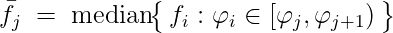

Seven views are produced:

| View | Length | Span |
|------|--------|------|
| Global  | 2001 | full phase  |
| Local   | 201  | ± 2 × T₁₄    |
| Secondary | 201 | centred on φ = 0.5 |
| Odd-transit | 201 | local, odd-indexed events only |
| Even-transit | 201 | local, even-indexed events only |
| Centroid global | 2001 | folded centroid magnitude |
| Centroid local | 201 | folded centroid magnitude |

Scalar features mirror the ExoMiner paper: `tce_period, tce_duration,
tce_depth, tce_count, oe_sigma, sec_sigma, centroid_sigma, scatter_mad,
crowdsap, sg_window`. Each scalar is rendered with a σ-badge so an
abnormal value (e.g. odd-even σ > 3) is visible at a glance.

---

## 11. FFI cutout rendering

For every fetched target, Vetstar pulls a Full-Frame-Image cutout from
**MAST TESScut** centred on the TIC RA/Dec. The pixel array is rendered
with the same **asinh percentile stretch** that `astrocut` uses by default:

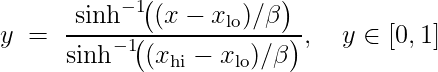

where `x_lo`, `x_hi` are the (default) 0.5th and 99.5th percentiles of the
pixel-value distribution, and `β` is the asinh softening parameter. The
stretch compresses bright stars while keeping faint structure visible —
crucial for spotting a faint neighbour that could be the real eclipsing
source.

The target's pixel position is overlaid as a red **+**, the photometric
aperture (from the SPOC pipeline bitmask, when available) as a yellow
outline. The result is cached and embedded in the PDF report.

---

## 12. Multi-sector aggregation

Multi-sector mode runs §§1-10 independently on up to 5 sectors, then
performs a cross-sector consistency check on the **two deepest events per
sector**:

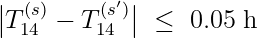

Events are grouped by duration (this ±0.05 h tolerance) and by period
(±2 % fractional tolerance, `PERIOD_MATCH_TOL_FRAC` in `pipeline.py`).
Up to **two distinct objects** are reported per target. An object is
flagged **confirmed** when it appears in ≥ 2 sectors with matching
duration *and* period. This separates a genuine repeating planet from a
second transit signal of different duration on the same star.

For each identified object the pipeline recomputes the **HCI** using the
real multi-sector detection counts, and re-extracts the full **ExoMiner**
view set from the sector showing that object's deepest event.

---

## 13. Time-system conventions

TESS times in BJD-2457000 ("BTJD") are converted to BJD for catalogue
cross-matching and ExoFOP submission:

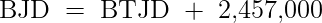

This conversion is applied automatically to the fitted transit epoch when
filling the ExoFOP TOI parameter table and the BJD epoch helper in the UI.
The pipeline never silently mixes BTJD and BJD: the table labels make the
system explicit at every step.

Kepler legacy data are stored in BKJD = BJD − 2454833; the parser converts
to BJD before any downstream calculation.

---

## 14. References

- **STEHM** — Hill, Kane, Foley & Schaefer (2026), *Smaller Than Earth
  Habitability Model.* arXiv:2605.00170.
- **Kopparapu** — Kopparapu et al. (2013, 2014), ApJ 765 131 & ApJ 787 L29.
- **Seager & Mallén-Ornelas (2003)** — ApJ 585 1038, the
  density-from-transit relation.
- **Csizmadia (2020)** — MNRAS 496 4442 (TLCM). Equations 59, 70 and
  Appendix A are used directly.
- **Pecaut & Mamajek (2013)** — ApJS 208 9 (dwarf-sequence table).
- **Kovács, Zucker & Mazeh (2002)** — A&A 391 369 (BLS).
- **Press & Rybicki (1989)** — ApJ 338 277 (Lomb-Scargle).
- **Valizadegan et al. (2022)** — ApJ 926 120 (ExoMiner).
- **Chen & Kipping (2017)** — ApJ 834 17 (Forecaster mass-radius).
- **Mandel & Agol (2002)** — ApJ 580 L171 (analytic transit model used by
  the SPOC DV fit Vetstar overlays).
- **Clubb (2008)** — JAAVSO 36 75 (RV semi-amplitude closed form).
- **Tian et al. (2009)** — GRL 36 L02205 (CO₂ escape, referenced by STEHM).
- **Kite & Barnett (2020)** — PNAS 117 18264 (exoplanet secondary
  atmospheres, referenced by STEHM).

---

*To regenerate the equation PNGs after editing any LaTeX, run
`docs/render_equations.ps1`. The script renders via the CodeCogs online
LaTeX→PNG service so no local LaTeX install is required.*
